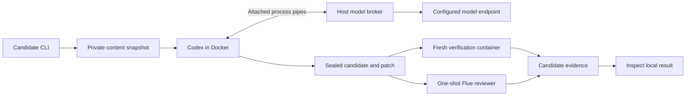

# Architecture

The implementation separates coordination, candidate production, and acceptance evidence. A model can propose a patch; it cannot certify the result or acquire publication authority.

## State and execution ownership

The fixture service uses SQLite WAL with full synchronous durability and short `BEGIN IMMEDIATE` transactions. Job transitions, events, and dispatch intents commit together. An exclusive OS lock permits one coordinator for a state directory. Local commands communicate through a private Unix socket.

Each fixture attempt has a durable execution ID, ownership epoch, and lease. Completion checks reject stale ownership. Restart adopts the same recorded execution under the service lock. A persisted start receipt and execution lock prevent duplicate fixture writers. A replacement execution is not inferred from an expired lease or missing process alone.

Repository candidate stages currently use private file journals and per-key locks. Coding intent precedes dispatch; a receipt precedes candidate intake. Verification and review retain their own intents and receipts. This keeps each stage independently inspectable and resumable. A unified job view over these candidate stages is the next coordination step.

Artifacts are content-addressed SHA-256 objects written by fsync and atomic rename. Reads verify the digest. Candidate manifests bind the original revision, content tree, changed paths, and binary patch. Evidence refers to the sealed candidate, and inspection rejects changed recipes or mismatched review digests.

## Workspace boundary

Snapshot preparation reads regular committed blobs from a clean repository. It creates a private content tree and Git index without copying repository history, hooks, credential helpers, or local configuration. The source checkout stays untouched. The private Git metadata is never mounted into a coding container.

The worker receives a read-only input manifest and a fixed runner. Its writable filesystem is disposable tmpfs. After execution, the host accepts only bounded regular-file output for explicit allowed paths and reconstructs it in the private candidate tree. Symlinks and unsupported modes reject. Existing files outside the allowed scope must remain unchanged; additional generated files outside the scope are discarded.

Verification starts from a fresh copy of the sealed candidate using a separately pinned recipe. Worker reports and exit codes are descriptive; this independent invocation establishes public-check evidence. Required test files should stay outside the allowed editing scope. Hidden checks remain the evaluator's responsibility.

## Model and credential boundary

The trusted host reads a Keychain credential and fixed gateway profile. A short-lived Node transport receives its request through an anonymous pipe and calls the configured HTTPS Responses endpoint. Redirects are rejected. Upstream failure bodies are replaced with a generic error, and returned model metadata uses the worker alias.

The worker container has `--network none`. A loopback HTTP server inside it translates Codex requests to bounded protocol frames on stdout and receives replies on stdin. The host validates every frame as untrusted, including frames that repository code could forge. It permits only Responses requests to the fixed model, enforces request/output/deadline allowances, disables storage and cross-response handles, and rejects hosted tools and remote media references. It never dispatches worker-requested host tools or arbitrary URLs.

Codex runs with an empty private home and explicit configuration. Hosted search, subagents, plugins, hooks, apps, browser use, and image generation are disabled. Its own sandbox bypass is used only inside the external Docker boundary. No CLI auth directory, host home, SSH agent, Docker socket, or evaluator files are mounted. Model request frames are not written to Docker logs.

| Resource | Coding | Verification |
|---|---|---|
| User | 65534:65534 | 65534:65534 |
| Network | None, with in-container loopback broker | None |
| CPU | 1 | 1 |
| Memory | 512 MiB | 256 MiB |
| PIDs | 96 | 64 |
| Root filesystem | Read-only | Read-only |
| Writable work directory | 64 MiB tmpfs | 64 MiB tmpfs |
| Privileges | Drop all capabilities, no-new-privileges | Same |

Container state establishes termination. Cancellation is serialized against startup and records a tombstone. A killed CLI or attach process alone is insufficient evidence that its descendants stopped. When Docker is unreachable, termination remains unconfirmed.

## Review and repairs

The Flue adapter invokes the existing trusted raw-diff CLI in a fresh host process with an allowlisted model environment. It never starts the watcher. Digest, schema, severity, blocking status, size, and changed-line membership are validated. A valid blocked verdict exits zero in Flue; the adapter reads the verdict rather than equating exit zero with acceptance.

A candidate is `ready_local` only when its pinned public checks pass, its review is clear, and it is current in its lineage. Two replacement patches are permitted. Each gets a new digest and fresh evidence; repeated candidates reject. A saved review intent without a receipt requires reconciliation before another billable invocation.

## Independent integration

The evaluator owns frozen suites, grading, hidden checks, and comparative decisions. This platform has substitution tests for the proposed exchange contract, described in [INTEGRATION.md](INTEGRATION.md). The active evaluator implementation is rechecked before connecting a live API.

Publication currently has an offline exact-candidate plan and fake-remote reconciliation contract. It exercises pagination, stale revisions, duplicate matches, and lost responses. A live publisher and external authorization workflow are subsequent components. Candidate commands deliver local artifacts.
