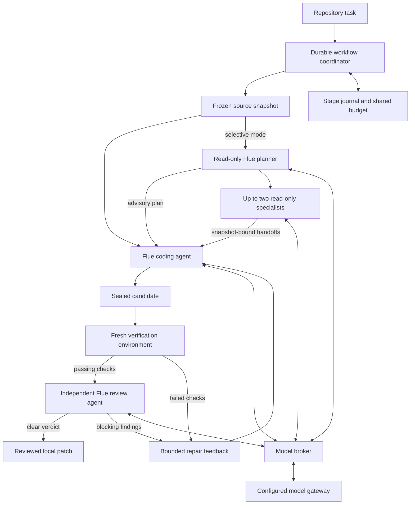

# Architecture

Flue owns agent execution. A deterministic coordinator owns the development workflow. The model gateway supplies LLM access to the configured roles. Docker supplies disposable execution environments, and content-addressed artifacts bind every check and review to an exact candidate.

## Agent runtime and roles

The TypeScript/JavaScript agent package uses `@flue/runtime` 2.0.3. `CodingAgent` and `ReviewAgent` are registered Flue agents, invoked with `start`, `init`, `dispatch`, and `read`. The coding agent uses Flue's sandbox tools inside the worker container. The reviewer receives the complete candidate diff in a fresh conversation and has no tools. Both roles use a registered provider through the same model broker; each can select its own configured model.

The default workflow has fixed transitions: implement, verify, review, then either finish or repair. Selective mode adds a read-only planning stage. Its validated plan may request at most two specialists over disjoint source file sets. Specialists run concurrently with read, grep and glob, return snapshot-bound handoffs, and cannot change files or approval policy. The same single coding agent remains responsible for every candidate. Single mode supplies a coding baseline with public checks and a distinct `verified_local` state.

The Flue runtime owns each agent's conversation and tool loop. The Python coordinator owns cross-stage policy, checkpoints, resource accounting, and exact-content acceptance. Snapshot, verification, and artifact services remain ordinary deterministic code. There is no coding-CLI dependency or second agent framework.

This follows Flue's distinction between [agent execution and durable workflows](https://flueframework.com/docs/guide/workflows/). The installed runtime source and integration tests establish the behavior used here; documentation alone is not treated as runtime verification.

## Durable workflow state

Each workflow key owns a private job directory, an immutable source snapshot, a stage journal, an agent execution directory, and candidate evidence. An exclusive file lock permits one active coordinator for that key. Atomic fsync-and-rename writes commit requests, stage intents, receipts, events, and the current candidate lineage.

A stage reserves its model-request allowance before dispatch. Completed stages account for actual requests; an interrupted stage without a receipt retains its reservation. Coding and review share one job budget and one absolute deadline. Resuming cannot reset either. Each task permits at most two repairs.

New workflows also maintain a broker-side ledger for each actual model request. Concurrent roles atomically reserve from shared request and token allowances before dispatch. Token admission reserves serialized input bytes, protocol margin and the entire output allowance; gateway-reported usage resolves that reservation. Missing usage and uncertain responses retain the allowance. An observed overrun is recorded and blocks further dispatch. This is conservative admission accounting, with reported usage tracked separately from estimates.

Structured traces link stage, model and observed tool-result spans to a workflow, with candidate, request and artifact digests. Trace exports contain no prompt or tool-output text. A tool-result span denotes a broker observation; deterministic verification remains the authority for test outcomes. Publication events join the same trace when exported.

Agent intent precedes execution. A completed agent receipt can finish candidate intake after a coordinator interruption, and completed workflow stages return their saved results. An interrupted model dispatch without a durable result is not automatically replayed. Each Flue attempt is a fresh process-lifetime conversation; recovery here reuses stage receipts rather than claiming to resume an arbitrary interrupted model/tool exchange.

The coordinator retains all attempts, marks superseded candidates stale, and rejects repeated repair candidates. A candidate becomes `ready_local` only after fresh public checks pass and a valid independent review is clear. The original repository is never an agent workspace.

The existing fixture service remains available for supervisor testing. It uses SQLite WAL transactions, execution epochs, leases, and durable effect intents to exercise crash recovery and stale ownership separately from repository workflows.

## Execution and provider boundaries

The host resolves a trusted gateway profile. Credentials can come from an explicitly named environment variable or a platform credential store. They are not repository configuration and are never placed in worker input, model context, or exported artifacts.

The worker container has no external network access. An internal loopback bridge carries bounded Chat Completions frames over attached process pipes to the host broker. The broker pins the endpoint and model, enforces request/output/deadline limits, and rejects remote media and undeclared tools. It validates returned tool calls too, so a response cannot invoke Flue built-ins outside the selected role. Upstream errors are sanitized and worker-visible model metadata uses an alias.

| Capability | Coding agent | Review agent | Verification |
|---|---|---|---|
| Model access | Bounded broker | Bounded broker | None |
| Repository access | Disposable content snapshot | Supplied diff only | Sealed candidate snapshot |
| Tools | Read, write, edit, bash, grep, glob | None | Fixed recipe argv |
| Output | Explicit allowed paths | Validated verdict | Exit status and check output |
| Network | None | None | None |
| Identity | Non-root | Non-root | Non-root |

All execution containers use a read-only root filesystem, temporary work storage, dropped capabilities, and resource limits. Source Git history, hooks, SSH agents, Docker sockets, host credentials, and evaluator data are not mounted. Worker output is collected through bounded channels, checked for regular files and allowed paths, and reconstructed by the host.

Cancellation writes a tombstone before stopping the active container. Startup and cancellation share execution ownership; concurrent cancellation requests serialize. The coordinator confirms container termination before recording cancellation as complete. An unavailable daemon leaves termination unconfirmed.

## Verification, review, and acceptance

Each candidate manifest binds the original revision, content tree, changed paths, and binary patch. Artifacts are SHA-256 addressed and verified on read. Public checks run in a new container from the sealed candidate using the recipe frozen at admission. Test files stay outside the coding scope unless explicitly allowed.

Review output must match the exact patch digest and schema. Findings must reference changed lines, and severity must agree with the risk and blocking decision. Exit zero alone never establishes acceptance. Repairs start from the preceding candidate, receive only public-check and review feedback, and produce a new patch against the original baseline.

The independent evaluator owns hidden suites, grading policy, and comparisons. Its contract is tracked in [INTEGRATION.md](INTEGRATION.md). Publication is a separate capability with its own durable journal and explicit approval of an immutable plan.

## Delivery and control panel

The GitHub publisher binds the authenticated actor, repository identity, original base, new branch, exact Git objects, candidate and evidence to a plan. Preparation reads remote state. Approval authorizes that plan digest. Immutable blobs, trees and commits have locally computed identities that must match GitHub's response. The publisher never updates an existing branch.

Branch and PR intents precede remote calls. After an uncertain PR response, reconciliation reads all matching PR pages and adopts only an exact open draft with the expected author, base, head and marker. An unresolved PR dispatch remains ambiguous and is not posted again. Remote file contents, modes and ancestry are checked before recording publication. CI results are associated with the published head.

FastAPI serves the React control panel and an authenticated local API. Operator and viewer capabilities are separate; mutation endpoints reject viewers. Host and Origin checks constrain the loopback service. The API reads the existing journals and invokes their owners for cancellation or publication. It does not introduce another workflow queue or independent state machine.

Evidence bundles carry the candidate, patch, recipe, verification output, review and bounded run metadata. Offline verification recomputes artifact identities and evidence bindings. It establishes bundle integrity and local readiness; independent acceptance remains the evaluator's responsibility.

Design decisions and failure behavior are recorded in [DESIGN.md](DESIGN.md).
