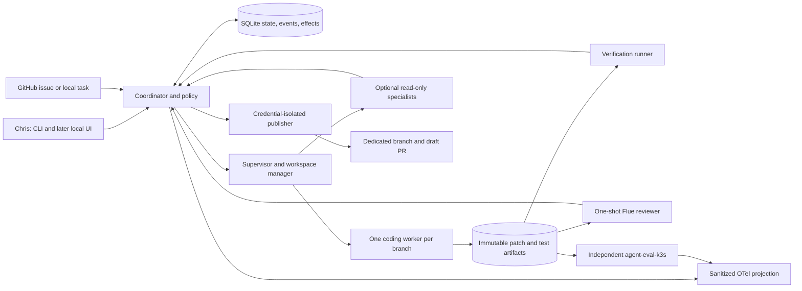
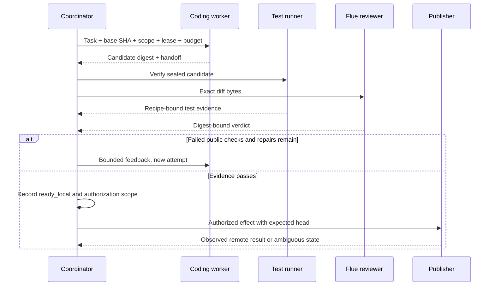

# Architecture and trust boundaries

Everything below is proposed. Current implemented evidence is in [RESEARCH.md](RESEARCH.md).

## Product boundary and ownership

The platform coordinates work; existing coding tools investigate and implement. The coordinator is mostly deterministic code, not an omnipotent model. It owns state transitions, policy, budgets, workspace ownership, evidence validation, and external-action authorization. A planning model may suggest subtasks but cannot grant capabilities or approve its own result.

| Component | Owns | Cannot do |
|---|---|---|
| Coordinator | State, scope, policy version, deadlines, allocation, accepted artifacts | Treat a model's success claim as evidence |
| Worker | Investigation, plan, patch, explanatory handoff in one workspace | Publish, edit policy/evaluator, access other jobs |
| Specialist | Bounded read-only question, evidence citations, uncertainty | Write branch, spawn peers, acquire more permissions |
| Verification runner | Execute pinned test recipe on candidate snapshot, record result | Trust worker-supplied exit codes or silently change recipe |
| Flue reviewer | Fresh-context diff verdict | Run arbitrary repository code or publish through this invocation |
| Evaluator | Independent hidden checks and promotion score | Let candidate agents set final graders/thresholds |
| Publisher | Reconcile authorized push/PR effects | Execute repository hooks, accept arbitrary shell instructions |
| Improvement agent | Diagnose sanitized traces and propose a versioned change | Access hidden answers or promote its proposal |

## End-to-end flow

1. **Intake.** Resolve repository allowlist and immutable base SHA. Snapshot issue text and explicit user constraints. GitHub issue bodies, repository instructions, comments, tool output, and patches are untrusted data. Reject submodule/LFS requirements initially with an actionable explanation. Refuse dirty input unless a future explicit snapshot option is requested; never reset Chris's checkout.
2. **Prepare.** Build a private clone from the selected commit without local hardlinks, credential helpers, hooks, or inherited repository configuration. Store it outside the original repository. Create a unique branch such as `agent/job-<id>`. No `codex/` prefix. A worktree is an optional trusted-local optimization, not a security boundary, because it shares Git metadata.
3. **Investigate and plan.** Worker records likely cause, files, risk, reproduction, and planned checks. Coordinator enforces task scope. Initially use one worker session for investigation and implementation. Later, coordinator may assign at most two independent read-only questions on the same immutable base. Join at a deadline; missing evidence remains explicit.
4. **Implement.** One active writer receives the bounded plan and capability profile. It may run tools inside its isolated workspace. Changing tests is allowed when required by the task, but changes to verification recipes or hidden evaluator code cannot become acceptance evidence.
5. **Seal candidate.** Stop writing, compute a candidate tree/patch digest, and create a fresh verification snapshot. Include new tracked candidate files and deletions; reject unsafe paths, symlink escapes, submodule changes, and oversized artifacts. Do not blindly include ignored files, credentials, or the worker's Git config.
6. **Verify and review.** Run baseline tests on the base when useful, then trusted recipes against the candidate in a new test container without model/GitHub credentials. Bind all results to candidate and recipe hashes. In parallel when resources permit, feed exact bounded diff bytes to Flue in a fresh process. Flue receives no author's persuasive rationale. Scope and acceptance requirements are evaluated separately.
7. **Bounded repair.** Return failing public checks and validated review findings to the same logical writer. Default two repair rounds. Every new patch invalidates prior tests and review. Record disputed findings and evidence; the writer cannot silently waive a blocker. Unresolved dispute or exhausted budget ends at `needs_attention`.
8. **Prepare publication.** Present patch, verification, review, known limitations, cost/usage, target branch/base, and proposed PR body. Default is local output. Explicit authorization may enable a push and draft PR for the exact candidate. It does not enable merge or deployment.
9. **Publish and reconcile.** Verify remote base/head, push the dedicated immutable candidate using expected remote state, then create or locate the draft PR. Return the verified URL and head SHA. If a response is lost, reconcile before retrying. A new external change invalidates the relevant approval/evidence and produces `stale`, never a silent rebase followed by publication.

## Durability and process ownership

Use SQLite WAL, foreign keys, explicit migrations, short `BEGIN IMMEDIATE` transactions, and full synchronous durability on a local filesystem. No network filesystem. One coordinator process owns state writes, guarded by an OS lock. CLI commands use a local Unix socket. Persist the next step before dispatch. Store job state, event, and effect intent in one transaction. Artifacts use temporary files, fsync, atomic rename, and digest validation; database references are committed after the artifact exists. Orphan artifact collection runs later.

A durable checkpoint means a stage result plus candidate identity, not a promise to replay a nondeterministic model conversation identically. Preserve optional agent session IDs, but recovery starts from verified artifacts. Never blindly resume a CLI session that may have already changed files or acted externally.

The supervisor starts a labeled container for each attempt and records its ID, owner, lease epoch, and monotonic runtime deadline. Heartbeat every 5 seconds; expire ownership after 30 seconds without renewal as initial configurable values. A new owner gets a higher epoch. Completions with older epochs cannot advance state. This fencing check protects accepted results, not the filesystem itself: each replacement attempt gets a separate workspace and cannot publish. Revoke credentials and confirm the old container stopped before reusing any writable volume. If termination cannot be established, quarantine it and wait for operator action.

On restart, inspect containers and records: adopt a live matching attempt, ingest its durable completion record, or stop/quarantine an orphan before retrying. Never interpret an expired lease as proof a process died. Laptop sleep, PID reuse, and Docker restart belong in the failure tests. Per-container wall timers protect against a dead coordinator. If the daemon is unreachable, report `cancelling` or `needs_attention`, not `cancelled`.

Retry only classified transient infrastructure errors, at most two retries per stage with jitter and an overall job deadline. Authentication, invalid input, policy denial, and deterministic test failures do not get infrastructure retries. Count Flue's internal retry/format attempts toward the total budget. Quality repairs have a separate counter. Cancellation persists first, revokes future effects, then signals and forcibly stops the execution container after a grace period. Already completed remote effects are reported, not pretended undone.

## Credentials and execution

For personal v1, assume Chris controls the Mac but repository code may be hostile. Keep state and artifacts in a mode-700 application directory outside repositories. No Docker socket, home directory, SSH agent, cloud credentials, Kubernetes config, or GitHub token is mounted into workers. Run non-root, drop capabilities, set no-new-privileges, bound CPU/RAM/PIDs/disk/time, and use an immutable base image. Test containers have no external network by default.

Model credentials require special care: an allowlisted environment is insufficient if arbitrary shell commands can read the model credential in that same environment. Prefer a trusted credential broker outside the execution container, exposing only model operations through a per-job short-lived token with quota and revocation. The token is still usable by code inside that worker, so restrict its endpoint, model, rate, and lifetime. It is not a general proxy. Verify the selected coding CLI supports this route before enabling untrusted tasks. If it does not, keep that adapter disabled for untrusted execution rather than mounting long-lived account tokens.

Use a prepared dependency image from a vetted recipe. If installation needs network, run it as an explicitly bounded stage with registry-only egress, no model/publication secrets, and lockfile hashes. Workers get only the model broker route plus explicitly approved services. Deny LAN, cloud metadata, host services, arbitrary DNS/HTTP tunnels, and control-plane endpoints. A proxy setting without an enforced network rule is not containment. M1 must test enforcement on the actual Docker-on-Mac network.

The publisher holds repository-scoped GitHub credentials in the host credential store. It uses fixed API/argv operations and sanitized Git configuration. It never runs candidate code. Starting with authenticated `gh` for Chris is reasonable; verify access without printing credentials. Future service deployment uses short-lived GitHub App installation tokens. Repository text can request actions but cannot authorize them. Omit raw prompts and private provider identifiers from exported telemetry.

## Deployment evolution

| Stage | Deployment | Evidence required before calling it usable |
|---|---|---|
| Personal | Python service, SQLite, Docker, CLI. Existing k3s evaluator remains separate and optional for routine tests. | Crash/cancel tests, isolated credentials, restore drill, actual repository task, clear sleep behavior |
| Shared single-team service | Linux host, authenticated API, Postgres, object artifacts, remote workers. Adopt Temporal for durable distributed orchestration. | OIDC, role checks, workload identity, TLS, fenced ownership, controlled egress, backup/restore, team audit and load tests |
| Enterprise candidate | Dedicated or strongly isolated workers per tenant, organization policy, managed secrets and retention | Tenant isolation adversarial tests, SSO/RBAC, encryption/key rotation, immutable audit sink, HA/DR exercises, quotas, incident response, vulnerability management, independent security review |

Do not let a team connect to the personal Unix-socket runtime over a public port. Tenant identity must come from authenticated context and be enforced in queries, artifact paths, queues, cache keys, credentials, and worker assignment. Namespace naming alone is insufficient. Separate evaluator credentials and hidden corpora from platform administrators who operate candidate agents where organizational independence is required.

Temporal migration should move scheduling ownership, not add a second scheduler. PostgreSQL retains business records/effect reconciliation; workflow history owns orchestration. Pin workflow versions for in-flight jobs. No Redis, Kubernetes control plane, vector database, service mesh, or distributed tracing backend is required to get the first local task working. Reuse the existing collector only as an optional exporter.

## Decisions and revisit conditions

| Decision | Reason | Revisit when |
|---|---|---|
| One writer per branch | Avoid conflicting edits and stale shared context | Independent patches have demonstrated value; still integrate serially and rerun combined checks |
| SQLite explicit workflow | One-machine deployment and atomic business transitions | Multiple coordinators, remote durable scheduling, or HA are required |
| Flue one-shot adapter | Existing strict contract, no duplicate watcher | Review requires repository navigation; add a separate read-only reviewer contract |
| External evaluator | Independent usefulness and trustworthy gates | Extend its adapter surface, never clone its graders into the worker |
| Local output by default | Makes the patch concrete before external action | Chris sets a repository-scoped publication policy |
| No learned routing initially | No evidence yet | A held-out comparison supports a versioned routing rule |
