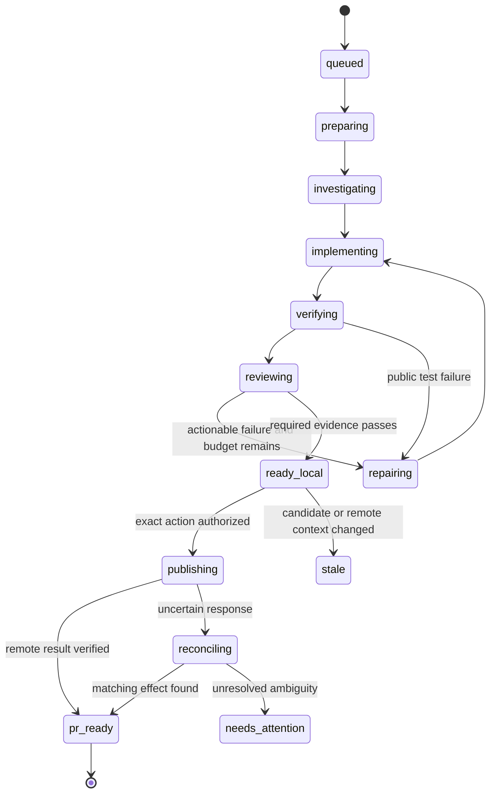

# State and integration contracts

Proposed schema v1. JSON examples describe interfaces, not implemented endpoints. Use Pydantic validation and exported JSON Schema with explicit versioning. Breaking changes get a new schema version. Preserve unknown provider events privately as bounded opaque data; do not let them create state transitions.

## Persistent records

| Record | Key fields and constraints |
|---|---|
| Repository | `repo_id`, canonical path/remote, allowlist, trusted recipe digest, policy digest; secrets referenced, never stored inline |
| Job | UUID, unique submission key, repo, base SHA, task artifact hash, mode, policy/recipe/adapter versions, state/version, deadline, cancellation flag, repair limit |
| Attempt | UUID, job, stage, ordinal, owner, lease epoch/expiry, container ID, workspace ID, started/completed time, result, error class, session ID |
| Artifact | Digest, type, size, private path, producer, candidate/base hashes, retention deadline; immutable content |
| Evidence | Candidate digest, recipe/reviewer/evaluator identity, result, report hash, created time; no reuse on changed candidate |
| Event | Job, monotonically increasing sequence, timestamp, actor, transition, attempt, safe metadata; unique `(job, sequence)` |
| Effect | Unique `(job, kind, candidate, target)`, expected remote state, authorization ID, request digest, state, remote ID, reconcile time |
| Authorization | Actor, repository, exact candidate, action set, expected target state, policy version, expiry; persisted before external action |
| Budget | Job reservation, attempt reservation, usage, pricing version, completeness, units, release time |
| Improvement proposal | Hypothesis, supporting run IDs, candidate config digest, parent version, experiment ID, promotion/rollback record |

SQLite metadata is authoritative; append-only JSONL is an export, not a second transactional state store. Audit append-only behavior under one local administrator is not tamper-proof. Later use a separate immutable audit service and access controls.



All active states may transition to `cancelling`, `needs_attention`, or `failed_infra` through explicit policy. `cancelled` requires termination confirmation. `rejected` means collected evidence failed; `failed_infra` means trustworthy evidence could not be collected. `ready_local` is a successful local deliverable, while `pr_ready` requires verified publication. Retry scheduling is stored on attempts, not invented by the model.

### Transition transaction

Read current version and valid owner/epoch; validate evidence references; atomically compare-and-swap the job version, append event, and insert unique effect intent. Dispatch only after commit. Crash after commit is recoverable by scanning pending effects. A result from an old epoch is retained for diagnosis but cannot advance the job. A second submission with the same key and same payload returns the existing job; the same key with different content returns a conflict.

## Handoff and coding adapter

```json
{
  "schema_version": "1.0",
  "job_id": "job-example",
  "attempt_id": "attempt-example",
  "lease_epoch": 3,
  "base_sha": "<immutable git commit>",
  "task_artifact": "sha256:<digest>",
  "allowed_paths": ["src/watcher.ts", "tests/watcher.test.ts"],
  "acceptance": ["A changed PR head cannot receive a success for an unreviewed diff"],
  "capability_profile": "isolated-coding-v1",
  "budget": {"wall_seconds": 1200, "max_repairs": 2},
  "output_contract": "candidate-v1"
}
```

Worker result: `status` (`completed|blocked|error`), candidate artifact, changed paths, summary, reproduction, checks claimed, unresolved questions, and usage with completeness flags. Claims about checks are advisory until verified by the trusted runner. Specialist result: question, answer, base SHA, file/line evidence, uncertainty, and suggested next step; default 8 KiB limit and no nested delegation. Repository paths must be relative and normalized. References must resolve inside the assigned snapshot.

Adapter interface: `capabilities()`, `start(spec, workspace, credential_handle)`, `events(handle)`, `inspect(handle)`, `cancel(handle)`, `collect(handle)`. The platform launches fixed executable plus argv arrays, uses stdin for task text, and drains bounded stdout/stderr concurrently. No shell interpolation of issue content. Capture binary version, configuration hash, session ID, and terminal exit status. Unknown exit/partial JSON becomes incomplete execution, not success.

Codex's installed `exec` help supports stdin, `--json`, `--output-schema`, and `--ignore-user-config`; implement a version-tested isolated invocation rather than inheriting personal hooks, MCP tools, or broad permissions. The documented event stream is not a remote process ownership protocol. Claude's stream parser is a separate adapter with its own fixtures. No claim of safe hard dollar enforcement is made merely because a CLI emits usage at completion.

## Flue integration: existing contract, new wrapper

Invoke the installed/pinned `pr-review-agent-flue/dist/cli.js` with exact UTF-8 diff bytes on stdin from a trusted adapter process. No `watcher.js`, no `--publish`, no GitHub token. Environment comes from a small explicit allowlist and the private model configuration. Source and artifact paths remain configurable, not hardcoded to Chris's home in application code.

```json
{
  "schema_version": "1.0",
  "input_sha256": "<64 lowercase hex characters>",
  "risk": "low",
  "blocked": false,
  "findings": [],
  "rationale": "<review explanation>"
}
```

Existing finding fields: `severity` (`blocker|major|minor|info`), `category` (`security|correctness|style|performance`), `file`, positive `line`, `detail`. Validate digest, complete strict schema, severity/risk relationship, and candidate membership. Add changed-hunk line validation in the platform wrapper because the existing schema only requires a positive number. Invalid evidence pauses acceptance; never discard a malformed blocker and call the review clean.

Current limits: 1 MiB complete diff, 96 KiB partition message, 120-second child limit, up to three actual HTTP requests per child and one fresh format correction per partition. Wrapper policy must account for partition count and all attempts. Oversized files stop for attention; silently reviewing a truncated diff is prohibited. Cost placeholders inside the existing provider are not billing data.

The existing watcher keeps publishing its normal review after a PR exists. The platform publishes no competing `PR review agent` status or completion marker. Its PR body may summarize private prepublication review evidence. If a platform check is later added, use a distinct name and exact commit binding.

## Evaluator integration

Keep three distinct operations:

1. Routine job verification uses a trusted recipe and candidate snapshot, with public feedback available for repair.
2. Reviewer-quality experiments continue through the evaluator's existing `eval-review-agent` interface and versioned corpus.
3. Platform policy experiments use an evaluator-owned coding task or a new black-box wrapper. The platform accepts only task input, emits a bounded result/candidate artifact, and does not see the suite manifest or goldens.

Proposed request envelope: `schema_version`, `run_id`, `candidate_digest`, `base_sha`, `adapter_version`, `trace_projection_digest`, and declared environment identity. The evaluator privately selects suite and thresholds. Proposed result: `accepted|rejected|infra_error`, report digest, evaluator revision, suite identity safe for reporting, and metric projection. This exact envelope is new integration work, not an existing agent-eval-k3s API.

For hidden coding tests, evaluator-owned infrastructure materializes the candidate in a separate execution environment and runs hidden checks there. Candidate code must not share host filesystem access with the hidden corpus. For isolated black-box tasks, expose only the declared application interface. Keep candidate workspaces, harness executables, and hidden tests on different trust boundaries. In personal deployment this is process/container separation under one owner, not protection from a malicious machine administrator.

## GitHub effects and duplicate prevention

Publisher receives: repository, branch, candidate commit/tree, base ref/SHA, desired draft title/body digest, effect key, and authorization record. Push only a dedicated branch with expected previous state, never force-update a human branch. Disable hooks and inherited helpers. Include a stable job marker in the draft PR body. Paginate lookup results and verify author, branch, base, head, and marker before adopting a match.

States: `pending -> in_flight -> confirmed`, or `in_flight -> ambiguous -> reconciling`. Commit intent before calling GitHub. If the process dies after GitHub accepted a POST, query before repeating it. Serialize publication per repository/branch. GitHub does not provide an atomic transaction with SQLite, so this is reconciled at-least-once execution, not exactly-once delivery. If a request might still be completing and absence cannot be established, leave it ambiguous for attention instead of issuing an immediate duplicate POST. Cancellation stops future intents; an already accepted effect remains in the audit record.

Bind reviews/tests to candidate hash, and publication approval to candidate plus target state. Recheck immediately before publishing; use commit-specific APIs where available and verify afterward. A race detected after publication yields `stale` evidence, never a claim that a later head was verified. Changes to the base require a fresh integration/test cycle.

## Budgets, telemetry, and retention

Proposed personal defaults: one active job, one writer, up to two read-only specialists only after M4, two repair rounds, 20-minute active job allowance, bounded per-stage retries, and 2 GiB artifacts per job. These are starting settings to measure, not proven ideal values. Wall deadlines persist across restart; sleeping beyond them pauses the task for attention instead of quietly extending spend.

A metered adapter reserves the maximum next-call charge before dispatch, reconciles actual tokens with a versioned price table, and refuses requests beyond the remaining allocation. Concurrent calls share the same reservation ledger. Count coordinator, specialists, reviewer, repairs, and failed requests. If the provider cannot bound or report usage, expose `cost_unknown`; enforce wall/turn/concurrency limits and refuse strict-dollar mode. A broker can cap requests, but cannot infer an opaque CLI's internal billing without supported usage evidence. Do not treat subscription usage or Flue's zero placeholders as zero cost.

Events: `job.created`, `attempt.started`, `artifact.sealed`, `check.completed`, `review.completed`, `repair.requested`, `effect.confirmed`, `job.cancelled`. Safe attributes: job/attempt IDs, stage, policy and artifact digests, public adapter alias, durations, outcome class, usage completeness. Do not export task text, diffs, command bodies, raw tool output, credential data, private endpoints, or internal model/provider identifiers. Redact at collection, not only in the OTel collector.

Keep private raw traces opt-in with 7-day expiry; retain local patches and evidence 30 days by default and job summaries 90 days. Pinned jobs override expiry explicitly. Protect active and ambiguous-effect artifacts from garbage collection. Delete abandoned workspaces only after process termination and preserved patch verification. Document backup scope and deletion behavior; copying a database without its referenced artifacts is not a complete backup.
