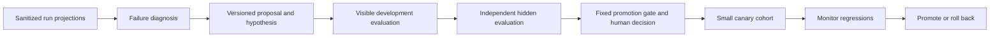

# Verification, benchmarks, and improvement

These are proposed gates, not completed test results. Existing reviewer results are distinguished in [RESEARCH.md](RESEARCH.md).

## Verification layers

1. **Deterministic core:** legal transitions, idempotency conflicts, version/epoch checks, evidence invalidation, budget reservations, retention reachability. Use fake clocks and controlled fault points.
2. **Process integration:** real SQLite, disposable Git repo, scripted CLI, Docker process tree, bounded stdout/stderr, restart and cancellation. Mocks alone cannot prove cleanup.
3. **Adapter contracts:** captured sanitized JSONL fixtures plus local fake model/GitHub servers; malformed/truncated events, output limits, blocked exit-zero reviews, unknown usage, API version drift.
4. **Security boundary:** filesystem canaries, symlinks, hostile repository instructions, credential/environment leakage, blocked network/LAN/control endpoints, malicious dependency scripts, hidden evaluator access. Do not put actual secrets into tests.
5. **Real task:** candidate-specific trusted tests, independent review, human patch inspection, and later verified PR head. Distinguish baseline failures from introduced failures; a broken baseline does not waive a new regression.
6. **Independent quality experiment:** agent-eval-k3s runs frozen tasks and graders; the platform emits candidate work and observable evidence.

## Required failure scenarios

| Injection | Required observable result |
|---|---|
| Crash before/after state-and-effect transaction | Job is absent or complete as a transaction; no half-written transition |
| Crash after container creation before handle saved | Labeled orphan discovered; no duplicate writer launched |
| Lease expires while worker still runs | Stale result rejected; old container terminated/quarantined; new workspace separate |
| Worker forks a child that ignores termination | Container-level kill confirmed before cancellation is terminal |
| Docker unavailable during cancel | Task remains cancelling/attention, never falsely cancelled |
| Model response lost or usage missing | Incomplete attempt retained, retry budget charged conservatively; cost unknown shown |
| Flue returns blocked with exit 0 | Candidate does not pass |
| Reviewer digest or line membership wrong | Invalid evidence, no clean verdict synthesized |
| Tests modified to skip failures | Trusted recipe and independent hidden checks still govern acceptance |
| Candidate changes after tests | All candidate-bound evidence invalidated |
| GitHub accepted POST, response lost | Reconcile by exact target and marker before any repeat; ambiguity visible |
| Remote head/base advances | Stale state; no success claim about unverified revision |
| Concurrent budget reservations | Aggregate reservation never exceeds known allowance |
| Disk fills or output floods | Bounded termination, retained diagnostic class, no false completion |
| Malicious repo requests credentials/publication | Capability denial outside model judgment, audited safely |
| OTel exporter fails | Job remains operable and canonical local evidence remains readable |
| Backup restored | DB, candidate artifacts, and effect records reconcile without missing-content success |
| Mac sleeps through deadlines | Resume reconciles running state and expires/pause policy explicitly |

Initial reliability targets are zero accepted stale results and zero duplicate confirmed effects in the fault suite; termination within 15 seconds when Docker is reachable; recovery decision within 60 seconds after healthy service restart. These are test targets, not SLO claims. Real cancellation latency and sleep cases must be measured.

## Benchmark protocol

Compare three versioned modes:

- **A, strong single agent:** same capable coding adapter/model, task, tools, public tests, and resource caps; it may self-check and use the full task budget. No artificial weak prompt or missing verification tools.
- **B, independent review:** A plus fresh-context Flue review and bounded revision. Review spend comes from the same total budget.
- **C, selective multi-agent:** B plus at most two read-only specialists under a preregistered routing rule. Include coordinator and specialist spend in the same budget.

Primary causal comparison uses the same model family/version for every role where supported. If Flue or another role cannot run that model, mark the comparison as a deployment configuration comparison, not a clean coordination ablation. Run model/provider diversity as a separate experiment. Pin adapter versions and reasoning settings. Give A the same opportunity to spend the remaining budget on additional reasoning/checks; do not equate agent count with matched compute.

Start with six credential-free fixtures to validate the harness. Then build a 12-task pilot, followed by a frozen 30-task corpus across correctness bugs, test/feature additions, cross-module changes, and concurrency/security behavior. Include Flue, scheduler, and evaluator-style tasks from frozen snapshots plus license-appropriate public fixtures. Keep tightly related tasks in the same split to prevent leakage. Do not fabricate 30 suitable tasks by making trivial variants of one bug. If only the pilot is feasible, report that limitation.

Maintain separate development and hidden holdout splits. Use three independent trials per task and variant initially, paired by task and trial schedule. Randomize/interleave variants to reduce provider/time drift; record model resolution time. Pin image digests, dependency cache state, CPU/RAM/PIDs, network, timeout behavior, and evaluator version. Run one benchmark job at a time on the Mac unless total resource allocation remains matched. A provider retry policy is part of the treatment and must be recorded.

Record at minimum:

| Metric | Definition |
|---|---|
| End-to-end acceptance | Accepted tasks / all attempted tasks, including infra failures in the denominator |
| Conditional quality | Accepted / successfully evaluated attempts, reported beside infra rate |
| First-pass and repaired acceptance | Separate results before and after feedback; never overwrite first attempts |
| Reliability | Per-task repeated-trial success frequency; fraction passing every trial |
| Review usefulness | Confirmed actionable findings, false positives, defects caught before human review |
| Efficiency | Total tokens, known billed/estimated cost, elapsed time, tool calls, retries, and human intervention |
| Safety | Unauthorized action attempts and actual effects, stale acceptance, duplicate effects, test tampering |
| Cost per accepted task | All known cohort spend divided by accepted count; undefined if none; unknown spend stays unknown |

Report per-task paired deltas and task-cluster bootstrap 95% intervals; repeated trials of the same task are not independent new tasks. Include raw denominators and uncertainty. Do not infer a population-level win from a handful of anecdotes. External infra faults get a separate label; if a rerun is warranted, preserve the original and use a preregistered paired rerun policy. Never rerun only the weaker variant until it looks better.

A proposed routing promotion gate: no unauthorized effects, no increase in deterministic critical failures, and either a positive acceptance delta with a lower confidence bound above zero at matched budget, or noninferior acceptance within a preregistered 3-percentage-point margin with at least 15% lower median known cost. Small samples may be inconclusive; that means keep the current route and gather more data. Those numerical margins are initial product choices to freeze before evaluation, not research-established constants.

## Within-task repair loop

Use only public check failures and reviewer findings for runtime repair. Feedback includes exact candidate digest, reproducible command/recipe, bounded output, finding IDs, and a clear success condition. The worker proposes a new candidate or a documented dispute. A repeated identical candidate or repeated unresolved finding triggers attention before wasting the full allowance. Default maximum two repairs; retries cannot reset the counter.

Never reveal hidden tests or golden answers to improve the score on the current task. A policy change, requirement change, or disputed blocking finding requires a separate decision with provenance. Test success and reviewer approval are independent conditions, not votes the coordinator averages.

## Across-task improvement loop

Begin with explicit failure classes: malformed handoff, missed test, stale evidence, reviewer false positive, scope violation, tool timeout, budget exhaustion, and infrastructure fault. Diagnosis should group evidence by policy/adapter version and distinguish application faults from environment faults. A proposal includes recurrence count, example run references, plausible cause, change diff, expected metric movement, affected risks, and rollback version.

Version prompt text, tool schemas, routing rules, verification recipes, and adapter configuration independently. Pin them per job. The improvement agent may edit a candidate prompt/tool/routing package and propose new development tests. It may not edit the evaluator executable, hidden corpus, final grader, promotion thresholds, or production default pointer. Proposed graders run in quarantine with reviewed execution limits and are never promoted merely because they approve their own proposal.

The evaluator receives the candidate package and runs the held-out comparison from its own immutable configuration. Return aggregate outcomes and permitted diagnostic categories. Do not send hidden answers back to the improvement agent. Repeated adaptive submissions can overfit even aggregate feedback; limit evaluation submissions per change family, keep a final untouched test set, rotate holdouts, and record all rejected proposals.

Promotion remains an explicit human decision after fixed gates. Start a small, declared canary cohort of new jobs; monitor critical failures, review disagreement, acceptance, cost, and intervention. Roll back the default pointer on a critical regression. Never rewrite completed results or change versions under in-flight jobs. agent-eval-k3s remains independently runnable against any CLI/HTTP target, not dependent on this platform's database or agent framework.

## Evidence that supports an interview claim

An acceptable claim states the measured task count, trial count, versions, resource envelope, and observed improvement or lack of it. A crash recovery demonstration supports the tested recovery behavior, not unlimited availability. A hidden benchmark supports quality on that suite, not enterprise readiness. Preserve negative findings: deciding not to delegate when it costs more without helping is sound engineering evidence.
